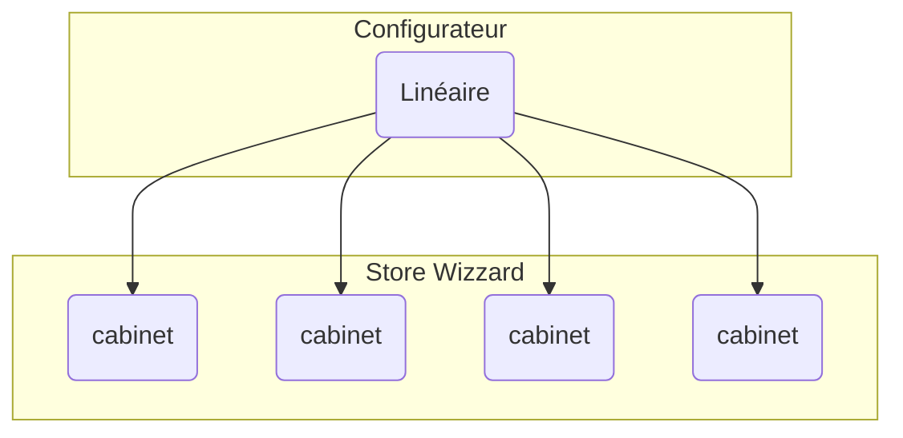

Example of Super Markdown file
==============================

## Table of content
-------------------

[TOC]


Introduction
------------

Super Markdown can generate Standalone Html file from markdown.


A text with list & example
--------------------------

Lorem ipsum dolor sit amet, consectetur adipisicing elit, sed do eiusmod
tempor incididunt ut labore et dolore magna aliqua. Ut enim ad minim veniam,
quis nostrud exercitation ullamco laboris nisi ut aliquip ex ea commodo
consequat. Duis aute irure dolor in reprehenderit in voluptate velit esse
cillum dolore eu fugiat nulla pariatur. Excepteur sint occaecat cupidatat non
proident, sunt in culpa qui officia deserunt mollit anim id est laborum.

**Bullet** list:

* apples
* oranges
* pears

**Numbered** list:

1. apples
2. oranges
3. pears

**Task** list:

* [ ] foo
* [x] bar
* [ ] baz


Mermaid graph
-------------





DotGraph
--------


### Simple example

a very short example find on [Graphviz manual](http://graphviz.readthedocs.io/en/latest/manual.html)

~~~dotgraph
digraph "pet-shop" {
    graph [rankdir=LR]
    node [shape=plaintext]
    edge [arrowhead=vee arrowsize=2]
        parrot
        dead
            parrot -> dead
}

~~~

and another example:

```dotgraph
// The Round Table
digraph {
	A [label="King Arthur"]
	B [label="Sir Bedevere the Wise"]
	L [label="Sir Lancelot the Brave"]

	A -> B
	A -> L
	B -> L [constraint=false]
} 

```

#### a Complex example

Here a more complex example find on [Graphviz Gallery](http://www.graphviz.org/content/Genetic_Programming)

~~~dotgraph

##"I made a program to generate dot files representing the LR(0) state graph along with computed LALR(1) lookahead for an arbitrary context-free grammar, to make the diagrams I used in this article: http://blog.lab49.com/archives/2471. The program also highlights errant nodes in red if the grammar would produce a shift/reduce or reduce/reduce conflict -- you may be able to go to http://kthielen.dnsalias.com:8082/ to produce a graph more to your liking". Contributed by Kalani Thielen.

##Command to get the layout: "dot -Gsize=10,15 -Tpng thisfile > thisfile.png"

digraph g {
  graph [fontsize=30 labelloc="t" label="" splines=true overlap=false rankdir = "LR"];
  ratio = auto;
  "state0" [ style = "filled, bold" penwidth = 5 fillcolor = "white" fontname = "Courier New" shape = "Mrecord" label =<<table border="0" cellborder="0" cellpadding="3" bgcolor="white"><tr><td bgcolor="black" align="center" colspan="2"><font color="white">State #0</font></td></tr><tr><td align="left" port="r0">&#40;0&#41; s -&gt; &bull;e $ </td></tr><tr><td align="left" port="r1">&#40;1&#41; e -&gt; &bull;l '=' r </td></tr><tr><td align="left" port="r2">&#40;2&#41; e -&gt; &bull;r </td></tr><tr><td align="left" port="r3">&#40;3&#41; l -&gt; &bull;'*' r </td></tr><tr><td align="left" port="r4">&#40;4&#41; l -&gt; &bull;'n' </td></tr><tr><td align="left" port="r5">&#40;5&#41; r -&gt; &bull;l </td></tr></table>> ];
  "state1" [ style = "filled" penwidth = 1 fillcolor = "white" fontname = "Courier New" shape = "Mrecord" label =<<table border="0" cellborder="0" cellpadding="3" bgcolor="white"><tr><td bgcolor="black" align="center" colspan="2"><font color="white">State #1</font></td></tr><tr><td align="left" port="r3">&#40;3&#41; l -&gt; &bull;'*' r </td></tr><tr><td align="left" port="r3">&#40;3&#41; l -&gt; '*' &bull;r </td></tr><tr><td align="left" port="r4">&#40;4&#41; l -&gt; &bull;'n' </td></tr><tr><td align="left" port="r5">&#40;5&#41; r -&gt; &bull;l </td></tr></table>> ];
  "state2" [ style = "filled" penwidth = 1 fillcolor = "white" fontname = "Courier New" shape = "Mrecord" label =<<table border="0" cellborder="0" cellpadding="3" bgcolor="white"><tr><td bgcolor="black" align="center" colspan="2"><font color="white">State #2</font></td></tr><tr><td align="left" port="r4">&#40;4&#41; l -&gt; 'n' &bull;</td><td bgcolor="grey" align="right">=$</td></tr></table>> ];
  "state3" [ style = "filled" penwidth = 1 fillcolor = "white" fontname = "Courier New" shape = "Mrecord" label =<<table border="0" cellborder="0" cellpadding="3" bgcolor="white"><tr><td bgcolor="black" align="center" colspan="2"><font color="white">State #3</font></td></tr><tr><td align="left" port="r5">&#40;5&#41; r -&gt; l &bull;</td><td bgcolor="grey" align="right">=$</td></tr></table>> ];
  "state4" [ style = "filled" penwidth = 1 fillcolor = "white" fontname = "Courier New" shape = "Mrecord" label =<<table border="0" cellborder="0" cellpadding="3" bgcolor="white"><tr><td bgcolor="black" align="center" colspan="2"><font color="white">State #4</font></td></tr><tr><td align="left" port="r3">&#40;3&#41; l -&gt; '*' r &bull;</td><td bgcolor="grey" align="right">=$</td></tr></table>> ];
  "state5" [ style = "filled" penwidth = 1 fillcolor = "black" fontname = "Courier New" shape = "Mrecord" label =<<table border="0" cellborder="0" cellpadding="3" bgcolor="black"><tr><td bgcolor="black" align="center" colspan="2"><font color="white">State #5</font></td></tr><tr><td align="left" port="r0"><font color="white">&#40;0&#41; s -&gt; e &bull;$ </font></td></tr></table>> ];
  "state6" [ style = "filled" penwidth = 1 fillcolor = "white" fontname = "Courier New" shape = "Mrecord" label =<<table border="0" cellborder="0" cellpadding="3" bgcolor="white"><tr><td bgcolor="black" align="center" colspan="2"><font color="white">State #6</font></td></tr><tr><td align="left" port="r1">&#40;1&#41; e -&gt; l &bull;'=' r </td></tr><tr><td align="left" port="r5">&#40;5&#41; r -&gt; l &bull;</td><td bgcolor="grey" align="right">$</td></tr></table>> ];
  "state7" [ style = "filled" penwidth = 1 fillcolor = "white" fontname = "Courier New" shape = "Mrecord" label =<<table border="0" cellborder="0" cellpadding="3" bgcolor="white"><tr><td bgcolor="black" align="center" colspan="2"><font color="white">State #7</font></td></tr><tr><td align="left" port="r1">&#40;1&#41; e -&gt; l '=' &bull;r </td></tr><tr><td align="left" port="r3">&#40;3&#41; l -&gt; &bull;'*' r </td></tr><tr><td align="left" port="r4">&#40;4&#41; l -&gt; &bull;'n' </td></tr><tr><td align="left" port="r5">&#40;5&#41; r -&gt; &bull;l </td></tr></table>> ];
  "state8" [ style = "filled" penwidth = 1 fillcolor = "white" fontname = "Courier New" shape = "Mrecord" label =<<table border="0" cellborder="0" cellpadding="3" bgcolor="white"><tr><td bgcolor="black" align="center" colspan="2"><font color="white">State #8</font></td></tr><tr><td align="left" port="r1">&#40;1&#41; e -&gt; l '=' r &bull;</td><td bgcolor="grey" align="right">$</td></tr></table>> ];
  "state9" [ style = "filled" penwidth = 1 fillcolor = "white" fontname = "Courier New" shape = "Mrecord" label =<<table border="0" cellborder="0" cellpadding="3" bgcolor="white"><tr><td bgcolor="black" align="center" colspan="2"><font color="white">State #9</font></td></tr><tr><td align="left" port="r2">&#40;2&#41; e -&gt; r &bull;</td><td bgcolor="grey" align="right">$</td></tr></table>> ];
  state0 -> state5 [ penwidth = 5 fontsize = 28 fontcolor = "black" label = "e" ];
  state0 -> state6 [ penwidth = 5 fontsize = 28 fontcolor = "black" label = "l" ];
  state0 -> state9 [ penwidth = 5 fontsize = 28 fontcolor = "black" label = "r" ];
  state0 -> state1 [ penwidth = 1 fontsize = 14 fontcolor = "grey28" label = "'*'" ];
  state0 -> state2 [ penwidth = 1 fontsize = 14 fontcolor = "grey28" label = "'n'" ];
  state1 -> state1 [ penwidth = 1 fontsize = 14 fontcolor = "grey28" label = "'*'" ];
  state1 -> state4 [ penwidth = 5 fontsize = 28 fontcolor = "black" label = "r" ];
  state1 -> state2 [ penwidth = 1 fontsize = 14 fontcolor = "grey28" label = "'n'" ];
  state1 -> state3 [ penwidth = 5 fontsize = 28 fontcolor = "black" label = "l" ];
  state6 -> state7 [ penwidth = 1 fontsize = 14 fontcolor = "grey28" label = "'='" ];
  state7 -> state8 [ penwidth = 5 fontsize = 28 fontcolor = "black" label = "r" ];
  state7 -> state1 [ penwidth = 1 fontsize = 14 fontcolor = "grey28" label = "'*'" ];
  state7 -> state2 [ penwidth = 1 fontsize = 14 fontcolor = "grey28" label = "'n'" ];
  state7 -> state3 [ penwidth = 5 fontsize = 28 fontcolor = "black" label = "l" ];
}


~~~
